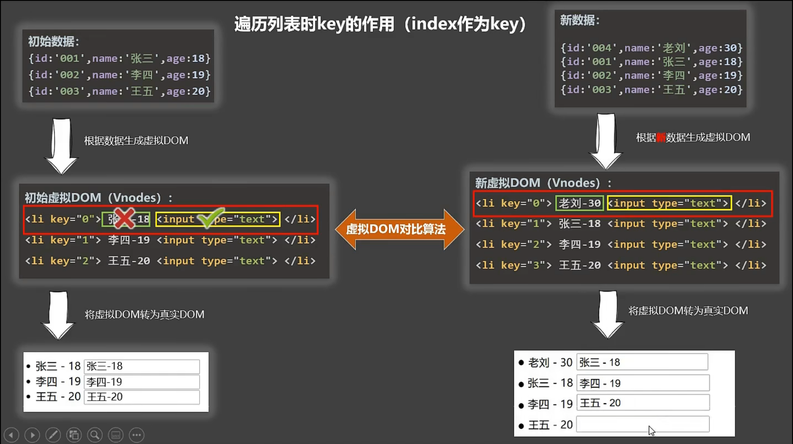
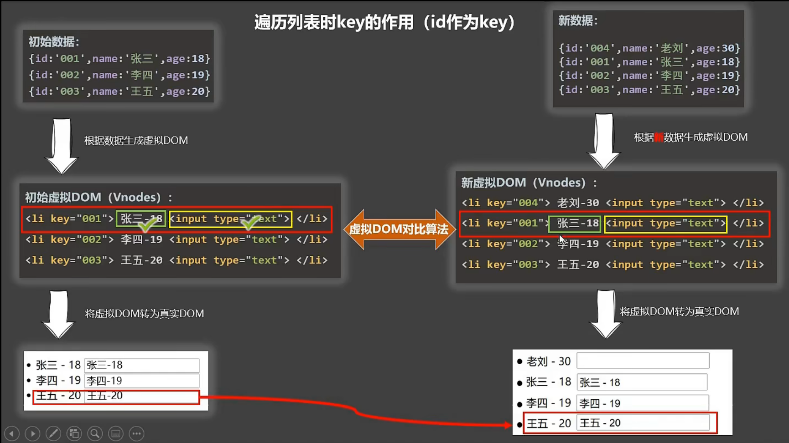

## 条件渲染 - 列表渲染

## 一、条件渲染

> **1.v-if**
>
> - 写法：
>   - (1).`v-if`="表达式"
>   -  (2).`v-else-if`="表达式"
>   - (3).`v-else`="表达式"
> - 适用于：切换频率较低的场景。
> - 特点：不展示的DOM元素直接被移除。
> - 注意：`v-if`可以和:`v-else-if`、`v-else`一起使用，但要求结构不能被“打断”。
>
> ```js
> <!-- 使用v-if做条件渲染 -->
> <h2 v-if="false">欢迎来到{{name}}</h2> 
> <h2 v-if="1 === 1">欢迎来到{{name}}</h2>
> 
> <!-- v-else和v-else-if -->
> <div v-if="n === 1">Angular</div>
> <div v-else-if="n === 2">React</div>
> <div v-else-if="n === 3">Vue</div>
> <div v-else>哈哈</div>  
> 
> <!-- v-if与template的配合使用 -->
> <template v-if="n === 1">
>     <h2>你好</h2>
>     <h2>尚硅谷</h2>
>     <h2>北京</h2>
> </template>
> //当判断成功时，<template>标签会自动消失，留下三个<h2>标签，保证结构的完整。
> ```
>
> **2.v-show**
>
> - 写法：`v-show`="表达式"
> - 适用于：切换频率较高的场景。
> - 特点：不展示的DOM元素未被移除，仅仅是使用样式隐藏掉
>
> ```js
> <!-- 使用v-show做条件渲染 -->
> <h2 v-show="false">欢迎来到{{name}}</h2>
> <h2 v-show="1 === 1">欢迎来到{{name}}</h2>   
> ```
>
> **3.备注**：使用v-if的时，元素可能无法获取到，而使用v-show一定可以获取到。


## 二、列表渲染

### 2.1、基本列表

> **v-for指令**
>
> 1. 用于展示列表数据
>
> 2. 语法：
>
>    ```js
>    v-for="(item, index) in xxx" :key="yyy"
>    ```
>
> 3. 可遍历：数组、对象、字符串（用的很少）、指定次数（用的很少）
>
>    - 数组: (item, index)
>    - 对象: (value, key)
>    - 字符串：(char, index)
>    - 数字：(number, index)

### 2.2、key的原理

##### Ⅰ、虚拟DOM中key的作用

> key是虚拟DOM对象的标识，当数据发生变化时，Vue会根据【新数据】生成【新的虚拟DOM】, 随后Vue进行【新虚拟DOM】与【旧虚拟DOM】的差异比较，比较规则如下：

##### Ⅱ、对比规则：

> (1). 旧虚拟DOM中找到了与新虚拟DOM相同的key：
>     	①若虚拟DOM中内容没变, 直接使用之前的真实DOM
>     	②若虚拟DOM中内容变了, 则生成新的真实DOM，随后替换掉页面中之前的真实DOM
>
> (2). 旧虚拟DOM中未找到与新虚拟DOM相同的key创建新的真实DOM，随后渲染到到页面。

##### Ⅲ、用index作为key可能会引发的问题：

> (1). 若对数据进行：**逆序添加**、**逆序删除**等破坏顺序操作: 会产生没有必要的真实DOM更新 `==>` 界面效果没问题, 但效率低
> (2). 如果结构中还包含输入类的DOM： 会产生错误DOM更新 `==>`界面有问题
>
> 

##### Ⅳ、开发中如何选择key:

> (1). 最好使用每条数据的唯一标识作为key, 比如id、手机号、身份证号、学号等唯一值。
> (2). 如果不存在对数据的逆序添加、逆序删除等破坏顺序操作，仅用于渲染列表用于展示，使用index作为key是没有问题的。
>
> 

### 2.3、列表过滤与排序

#### Ⅰ、过滤操作

> 可以使用watch也可以使用计算属性，使用计算属性更加简单方便一点.

```js
<!DOCTYPE html>
<html>
	<head>
		<meta charset="UTF-8" />
		<title>列表过滤</title>
		<script type="text/javascript" src="../js/vue.js"></script>
	</head>
	<body>
		<!-- 准备好一个容器-->
		<div id="root">
			<h2>人员列表</h2>
			<input type="text" placeholder="请输入名字" v-model="keyWord">
			<ul>
				<li v-for="(p,index) of filPerons" :key="index">
					{{p.name}}-{{p.age}}-{{p.sex}}
				</li>
			</ul>
		</div>

		<script type="text/javascript">
			Vue.config.productionTip = false
			
			//用watch实现
			//#region 
			/* new Vue({
				el:'#root',
				data:{
					keyWord:'',
					persons:[
						{id:'001',name:'马冬梅',age:19,sex:'女'},
						{id:'002',name:'周冬雨',age:20,sex:'女'},
						{id:'003',name:'周杰伦',age:21,sex:'男'},
						{id:'004',name:'温兆伦',age:22,sex:'男'}
					],
					filPerons:[]
				},
				watch:{
					keyWord:{
						immediate:true,
						handler(val){
							this.filPerons = this.persons.filter((p)=>{
								return p.name.indexOf(val) !== -1
							})
						}
					}
				}
			}) */
			//#endregion
			
			//用computed实现
			new Vue({
				el:'#root',
				data:{
					keyWord:'',
					persons:[
						{id:'001',name:'马冬梅',age:19,sex:'女'},
						{id:'002',name:'周冬雨',age:20,sex:'女'},
						{id:'003',name:'周杰伦',age:21,sex:'男'},
						{id:'004',name:'温兆伦',age:22,sex:'男'}
					]
				},
				computed:{
					filPerons(){
						return this.persons.filter((p)=>{
							return p.name.indexOf(this.keyWord) !== -1
						})
					}
				}
			}) 
		</script>
</html>

```

#### Ⅱ、排序操作

```js
<!DOCTYPE html>
<html>
	<head>
		<meta charset="UTF-8" />
		<title>列表排序</title>
		<script type="text/javascript" src="../js/vue.js"></script>
	</head>
	<body>
		<!-- 准备好一个容器-->
		<div id="root">
			<h2>人员列表</h2>
			<input type="text" placeholder="请输入名字" v-model="keyWord">
			<button @click="sortType = 2">年龄升序</button>
			<button @click="sortType = 1">年龄降序</button>
			<button @click="sortType = 0">原顺序</button>
			<ul>
				<li v-for="(p,index) of filPerons" :key="p.id">
					{{p.name}}-{{p.age}}-{{p.sex}}
					<input type="text">
				</li>
			</ul>
		</div>

		<script type="text/javascript">
			Vue.config.productionTip = false
			
			new Vue({
				el:'#root',
				data:{
					keyWord:'',
					sortType:0, //0原顺序 1降序 2升序
					persons:[
						{id:'001',name:'马冬梅',age:30,sex:'女'},
						{id:'002',name:'周冬雨',age:31,sex:'女'},
						{id:'003',name:'周杰伦',age:18,sex:'男'},
						{id:'004',name:'温兆伦',age:19,sex:'男'}
					]
				},
				computed:{
					filPerons(){
						const arr = this.persons.filter((p)=>{
							return p.name.indexOf(this.keyWord) !== -1
						})
						//判断一下是否需要排序
						if(this.sortType){
							arr.sort((p1,p2)=>{
								return this.sortType === 1 ? p2.age-p1.age : p1.age-p2.age
							})
						}
						return arr
					}
				}
			}) 

		</script>
</html>
```

### 2.4、Vue监视数据

> 1、vue会监视data中所有层次的数据。
>
> 2、如何监测对象中的数据？
>
> ​	通过setter实现监视，且要在new Vue时就传入要监测的数据。  
>
> ​	(1).对象中后追加的属性，Vue默认不做响应式处理
>
> ​	(2).如需给后添加的属性做响应式，请使用如下API：
>
> ​    	`Vue.set(target，propertyName/index，value)` 或
>
> 	 ` vm.$set(target，propertyName/index，value)`
>
> ```js
> Vue.set(this.student,'sex','男')
> this.$set(this.student,'sex','男')
> ```
>
> 3、如何监测数组中的数据？
>
> - 通过包裹数组更新元素的方法实现，本质就是做了两件事：
> -  调用原生对应的方法对数组进行更新。
> - 重新解析模板，进而更新页面。
>
> 4、在Vue修改数组中的某个元素一定要用如下方法：
> 	(1). 使用这些API:`push()`、`pop()`、`shift()`、`unshift()`、`splice()`、`sort()`、`reverse()`【这些API不是原生的方法，Vue 将被侦听的数组的变更方法进行了包裹，所以它们也将会触发视图更新.】
>
> ```js
> this.persons.splice(0,1,{id:'001',name:'马老师',age:50,sex:'男'})
> ```
>
> ​	(2). `Vue.set()` 或 `vm.$set()`
>
> ```js
> Vue.set(this.student。hobby,1,'打游戏')
> this.$set(this.student。hobby,1,'打游戏')
> ```
>
> 5、**特别注意：Vue.set() 和 vm.$set() 不能给vm 或 vm的根数据对象 添加属性！！！**
>
> `Vue.set()`向响应式对象中添加一个 property，并确保这个新 property 同样是响应式的，且触发视图更新。它必须用于向响应式对象上添加新 property，因为 Vue 无法探测普通的新增 property (比如 `this.myObject.newProperty = 'hi'`).但是添加的实例不允许是Vue实例或者Vue实例的根数据对象。

#### 模拟一个数据监测

```js
let data = {
    name:'尚硅谷',
    address:'北京',
}

//创建一个监视的实例对象，用于监视data中属性的变化
const obs = new Observer(data)		
console.log(obs)	

//准备一个vm实例对象
let vm = {}
vm._data = data = obs

function Observer(obj){
    //汇总对象中所有的属性形成一个数组
    const keys = Object.keys(obj)
    //遍历
    keys.forEach((k)=>{
        Object.defineProperty(this,k,{
            get(){
                return obj[k]
            },
            set(val){
                console.log(`${k}被改了，我要去解析模板，生成虚拟DOM.....我要开始忙了`)
                obj[k] = val
            }
        })
    })
}
```

