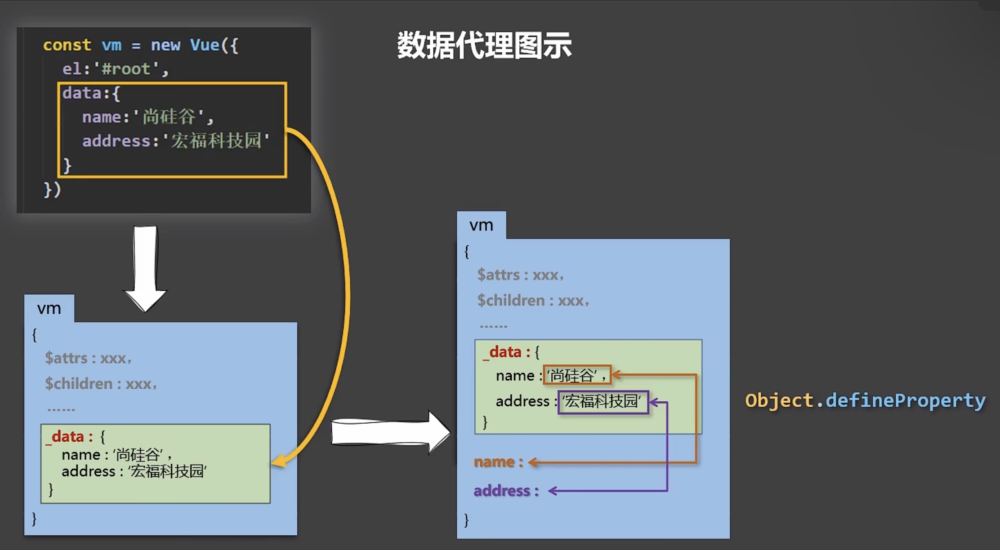

## 数据代理 && 事件处理 && 键盘事件


## 一、数据代理

### 1.1、Object.defineproperty方法

```js
Object.defineProperty(person,'age',{
    // value:18,
    // enumerable:true, //控制属性是否可以枚举，默认值是false
    // writable:true, //控制属性是否可以被修改，默认值是false
    // configurable:true //控制属性是否可以被删除，默认值是false

    //当有人读取person的age属性时，get函数(getter)就会被调用，且返回值就是age的值
    get(){
        console.log('有人读取age属性了')
        return number
    },

    //当有人修改person的age属性时，set函数(setter)就会被调用，且会收到修改的具体值
    set(value){
        console.log('有人修改了age属性，且值是',value)
        number = value
    }

})
```

### 1.2、Vue中的数据代理

> 数据代理：通过一个对象代理对另一个对象中属性的操作（读/写）
>
> **1.Vue中的数据代理：**
>
> 通过vm对象来代理data对象中属性的操作（读/写）
>
>  **2.Vue中数据代理的好处：**
>
> 更加方便的操作data中的数据
>
> **3.基本原理：**
>
> - 通过Object.defineProperty()把data对象中所有属性添加到vm上。
>
> - 为每一个添加到vm上的属性，都指定一个getter/setter。
>
> - 在getter/setter内部去操作（读/写）data中对应的属性。




## 二、事件处理

### 2.1、事件的基本使用

> 1.使用v-on:xxx 或 @xxx 绑定事件，其中xxx是事件名；
>
> ```js
> <button v-on:click="showInfo">点我提示信息</button>
> <button @click="showInfo">点我提示信息</button>
> ```
>
> 2.事件的回调需要配置在methods对象中，最终会在vm上；
>
> 3.methods中配置的函数，**不要用箭头函数**！否则this就不是vm了；
>
> 4.methods中配置的函数，都是被Vue所管理的函数，**this的指向是vm 或 组件实例对象**；
>
> 5.@click="demo" 和 @click="demo($event)" 效果一致，但后者可以传参。
>
> ```js
> <button @click="showInfo1">（不传参）</button>
> <button @click="showInfo2($event,1,2,3)">（传参）</button>
> ```

### 2.2、事件修饰符

> *Vue中的事件修饰符：*
>
> 1.`prevent`：阻止默认事件（常用）；
>
> ```js
> <!-- 修饰符可以连续写 -->
> <a href="http://www.atguigu.com" @click.prevent.stop="showInfo">点我</a>
> ```
>
> 2.`stop`：阻止事件冒泡（常用）；
>
> ```js
> <!-- 阻止事件冒泡（常用） -->
> <div class="demo1" @click="showInfo">
>     <button @click.stop="showInfo">点我提示信息</button>
> </div>
> ```
>
> 3.`once`：事件只触发一次（常用）；
>
> ```js
> <!-- 事件只触发一次（常用） -->
> <button @click.once="showInfo">点我提示信息</button>
> ```
>
> 4.`capture`：使用事件的捕获模式；
>
> ```js
> <!-- 使用事件的捕获模式 -->
> <div class="box1" @click.capture="showMsg(1)">
>     div1
> 	<div class="box2" @click="showMsg(2)">
>     	div2
> 	</div>
> </div>
> ```
>
> 5.`self`：只有event.target是当前操作的元素时才触发事件；
>
> ```js
> <!-- 只有event.target是当前操作的元素时才触发事件； -->
> <div class="demo1" @click.self="showInfo">
>     <button @click="showInfo">点我提示信息</button>
> </div>
> ```
>
> 6.`passive`：事件的默认行为立即执行，无需等待事件回调执行完毕；（通常在移动端使用）
>
> ```js
> <!-- 事件的默认行为立即执行，无需等待事件回调执行完毕； -->
> <ul @wheel.passive="demo" class="list">
>     <li>1</li>
>     <li>2</li>
>     <li>3</li>
>     <li>4</li>
> </ul>
> 
> demo(){
>     for (let i = 0; i < 100000; i++) {
>         console.log('#')
>     }
>     console.log('累坏了')
> }
> //此例中，如果不加.passive，则触发wheel事件后必须在执行完demo中的100000次循环后才会执行滚动条滚动事件，会造成卡顿。
> //值得注意的是，scroll事件就没有这种情况
> ```

### 2.3、键盘事件

```js
<input type="text" placeholder="按下回车提示输入" @keyup.ctrl.y="showInfo">
```

> 1.Vue中常用的按键别名：
>
> - 回车 => `enter`
> - 删除 => `delete` (捕获“删除”和“退格”键)
> - 退出 => `esc`
> - 空格 => `spac`
> - 换行 =>` tab` (**特殊，必须配合`keydown`去使用**)
> - 上 => `up`
> - 下 =>` down`
> - 左 =>` left`
> - 右 => `right`
>
> 2.Vue未提供别名的按键，可以使用按键原始的key值去绑定，但注意要转为kebab-case（短横线命名）
>
>  3.系统修饰键（用法特殊）：`ctrl`、`alt`、`shift`、`meta(Win)`
>
> (1)配合`keyup`使用：按下修饰键的同时，再按下其他键，随后释放其他键，事件才被触发。
>
> (2)配合`keydown`使用：正常触发事件。
>
> 4.也可以使用keyCode去指定具体的按键（不推荐,已从web标准中移除）
>
> 5.Vue.config.keyCodes.自定义键名 = 键码，可以去定制按键别名
>
> ```js
> Vue.config.keyCodes.huiche = 13
> ```
