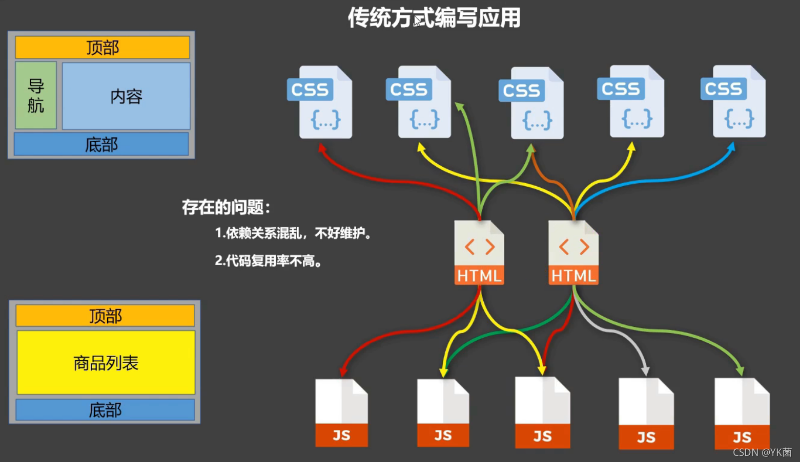
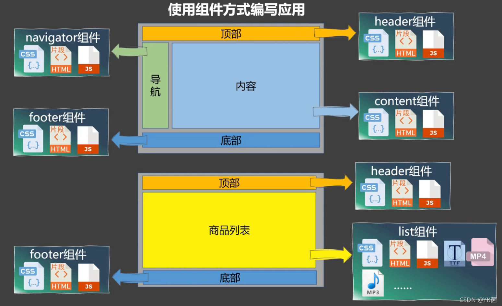
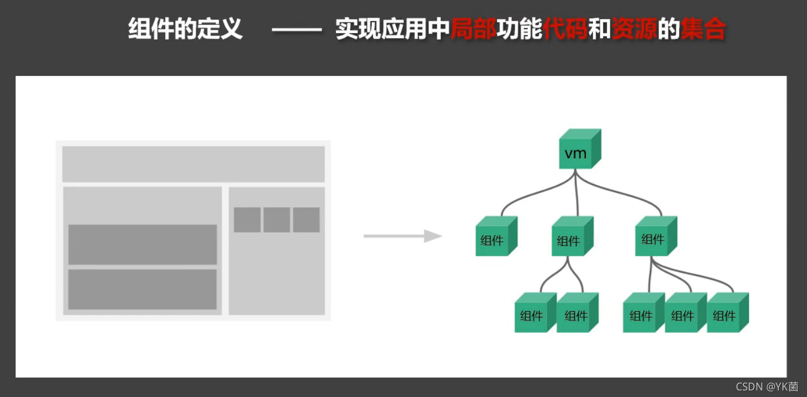
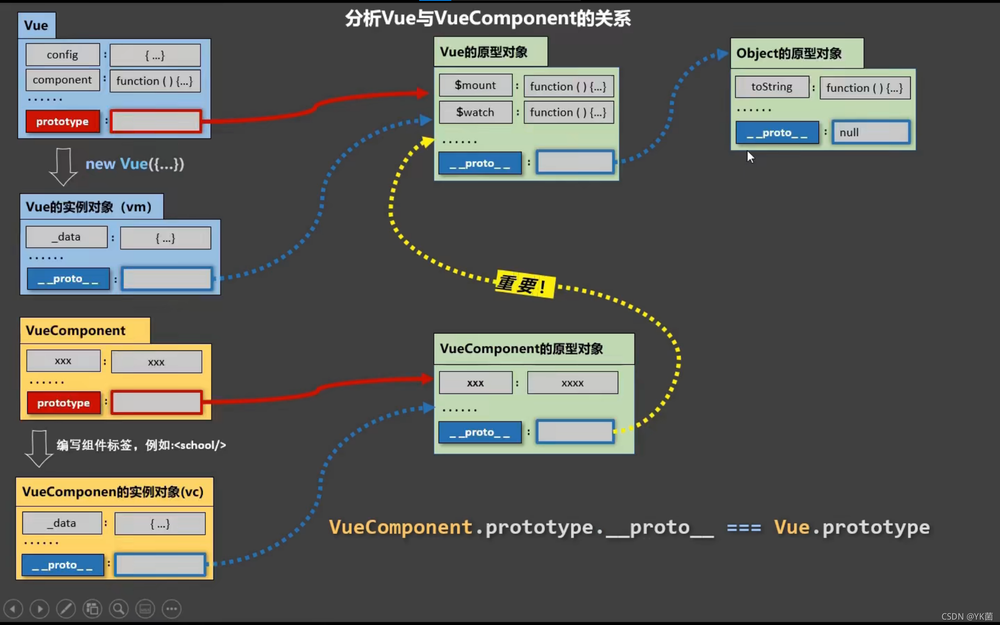

# Vue组件定义与使用 - 非单文件组件 - 单文件组件 - VueComponent


## 零、组件的概念

### 0.1、传统方式编写应用

> 1. 依赖关系混乱，不好维护
> 2. 代码复用率不高




### 0.2、 使用组件方式编写应用




### 0.3、 组件的定义

> 实现应用中局部功能代码和资源的集合




## 一、非单文件组件

### 1.1、使用组件的三大步骤

> 1. 定义组件（创建组件）
>2. 注册组件
> 3. 使用组件（写组件标签）


### 1.2、如何定义一个组件

> 使用`Vue.extend(options)`创建，其中`options`和`new Vue（options)`时传入的那个`options`几乎一样，但有以下区别：
>
> - 不要写`el`——最终所有的组件都要经过一个vm的管理，由vm中的el决定服务哪个容器
> - `data`必须写成函数——避免组件被复用时，数据存在引用关系
>
> **【备注】**使用tempalte可以配置组件结构
>
> ```js
> //创建hello组件
>   const hello = Vue.extend({
>     template: `
> 				<div>	
> 					<h2>你好啊！{{name}}</h2>
> 				</div>
> 			`,
>     data() {
>       return {
>         name: 'Tom'
>       }
>     }
>   })
> ```


### 1.3、如何注册组件

> 1. 局部注册：`new Vue`的时候传入`components`选项
> 2. 全局注册：`Vue.component`(‘组件名’, 组件)
>
> ```js
> //全局注册组件
>   Vue.component('hello', hello)
> 
> //局部注册组件
>   new Vue({
>     el: '#root',
>     data: {
>       msg: '你好啊！'
>     },
>     components: {
>       hello: hello
>     }
>   })
> ```


### 1.4、注意点

> **1、关于组件名**
>
> - 一个单词组成
>   - 第一种写法（首字母小写）：`school`
>   - 第二种写法（首字母大写）：`School`
>
> - 一个单词组成
> - 第一种写法（首字母小写）：school
> - 第二种写法（首字母大写）：School
>
> - 多个单词组成
>
>   - 第一种写法（kebab-case命名）：my-school
>   - 第二种写法（CamelCase命名）：MySchool（需要Vue脚手架支持）
>
> - 备注
>   - ① 组件名尽可能回避HTML中已有的元素名称，例如h2、H2
>   - ② 可以使用name配置项指定组件在开发者工具中呈现的名字
>
> **2、关于组件标签**
>
> - 第一种写法：<school></school>
> - 第二种写法：<school/> (不使用脚手架会导致后续组件不能渲染)
>
> **3、简写方式**
>
> - const school = Vue.extend(options) 可以简写成 const school = options


### 1.5、组件嵌套

```js
<body>
    <!-- 准备好一个容器-->
    <div id="root">

        </div>
</body>

<script type="text/javascript">
    Vue.config.productionTip = false //阻止 vue 在启动时生成生产提示。

    //定义student组件
    const student = Vue.extend({
        name:'student',
        template:`
                    <div>
                        <h2>学生姓名：{{name}}</h2>	
                        <h2>学生年龄：{{age}}</h2>	
                    </div>
                `,
        data(){
            return {
                name:'尚硅谷',
                age:18
            }
        }
    })

    //定义school组件
    const school = Vue.extend({
        name:'school',
        template:`
                    <div>
                        <h2>学校名称：{{name}}</h2>	
                        <h2>学校地址：{{address}}</h2>	
                        <student></student>
                    </div>
                `,
        data(){
            return {
                name:'尚硅谷',
                address:'北京'
            }
        },
        //注册组件（局部）
        components:{
            student
        }
    })

    //定义hello组件
    const hello = Vue.extend({
        template:`<h1>{{msg}}</h1>`,
        data(){
            return {
                msg:'欢迎来到尚硅谷学习！'
            }
        }
    })

    //定义app组件
    const app = Vue.extend({
        template:`
                    <div>	
                        <hello></hello>
                        <school></school>
                    </div>
                `,
        components:{
            school,
            hello
        }
    })

    //创建vm
    new Vue({
        template:'<app></app>',
        el:'#root',
        //注册组件（局部）
        components:{app}
    })
</script>
```


## 二、VueComponent

> 1. app组件本质是一个名为`VueComponent`的构造函数，且不是程序员定义的，是`Vue.extend`生成的
>
> 2. 我们只需要写`<app/>`或`<app></app>`，Vue解析时会帮我们创建app组件的实例对象，即`Vue`帮我们执行`new VueComponent(options)`
>
> 3. 特别注意：每次调用`Vue.extend`，返回的都是一个全新的`VueComponent`
>
> 4. 关于this指向：
>    ① 组件配置中：`data`函数、`methods`中的函数、`watch`中的函数、`computed`中的函数 它们的this均是【`VueComponent实例对象`】
>    ② `new Vue(options)`配置中：`data`函数、`methods`中的函数、`watch`中的函数、`computed`中的函数 它们的this均是【Vue实例对象】
>
> 5. `VueComponent`的实例对象，以后简称`vc`（也可称之为：组件实例对象）
>
> 6. `Vue`的实例对象，以后简称为`vm`

##### 一个重要的内置关系

> ```js
> VueComponent.prototype.__proto__ === Vue.prototype
> ```
>
> 这样组件实例对象vc就可以访问到Vue原型上的属性和方法。
>
> 
>
> ```js
> <script type="text/javascript">
>   Vue.config.productionTip = false //阻止 vue 在启动时生成生产提示。
>   Vue.prototype.x = 99
> 
>   //定义school组件
>   const school = Vue.extend({
>     name: 'school',
>     template: `
> 				<div>
> 					<h2>学校名称：{{name}}</h2>	
> 					<h2>学校地址：{{address}}</h2>	
> 					<button @click="showX">点我输出x</button>
> 				</div>
> 			`,
>     data() {
>       return {
>         name: '尚硅谷',
>         address: '北京'
>       }
>     },
>     methods: {
>       showX() {
>         console.log(this.x)
>       }
>     },
>   })
> 
>   //创建一个vm
>   const vm = new Vue({
>     el: '#root',
>     data: {
>       msg: '你好'
>     },
>     components: {
>       school
>     }
>   })
> 
> 
>   //定义一个构造函数
>   /* function Demo(){
>   	this.a = 1
>   	this.b = 2
>   }
>   //创建一个Demo的实例对象
>   const d = new Demo()
> 
>   console.log(Demo.prototype) //显示原型属性
> 
>   console.log(d.__proto__) //隐式原型属性
> 
>   console.log(Demo.prototype === d.__proto__)//true
> 
>   //程序员通过显示原型属性操作原型对象，追加一个x属性，值为99
>   Demo.prototype.x = 99
> 
>   console.log('@',d) */
>   
> </script>
> ```


## 三、单文件组件 vue 文件的组成(3 个部分)

### 3.1、组成

##### Ⅰ、模板页面

```js
<template>
	页面模板
</template>
```

##### Ⅱ、JS模块页面

```js
<script>
    //组件交互相关的代码（数据、方法d）
export default {
	data() {return {}},
	methods: {},
	computed: {},
	components: {}
}
</script>
```

##### Ⅲ、样式

```js
<style>
	样式定义
</style>
```


### 3.2、基本使用

> 1. 引入组件
> 2. 映射成标签
> 3. 使用组件标签

**APP.vue**

```js
<template>
	<div>
		<HelloWorld></HelloWorld>
		<hello-world></hello-world>
	</div>
</template>

<script>
	import HelloWorld from './components/HelloWorld'
	export default {
		name: 'App',
		components: {
			HelloWorld
		}
	}
</script>
```

**main.js**

```js
import App from './App'

new Vue({
	el: '#root',
	component: {App},
})
```


### 3.3、关于标签名与标签属性名书写问题

> 1. 写法一: 一模一样
> 2. 写法二: 大写变小写, 并用-连接